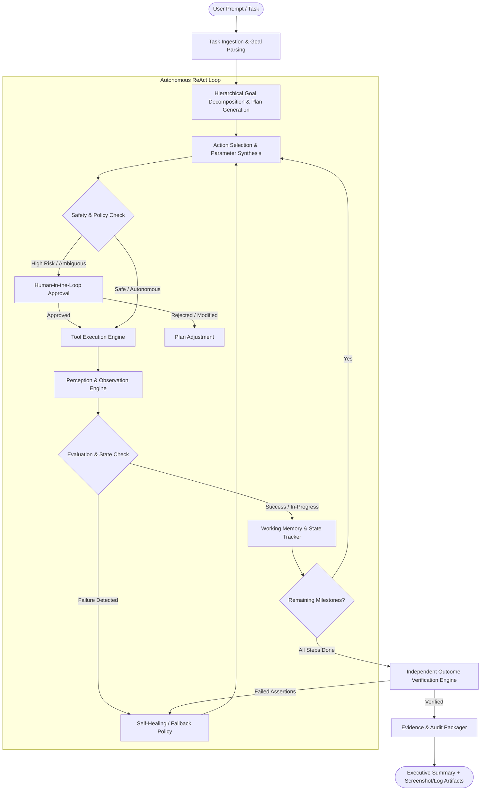
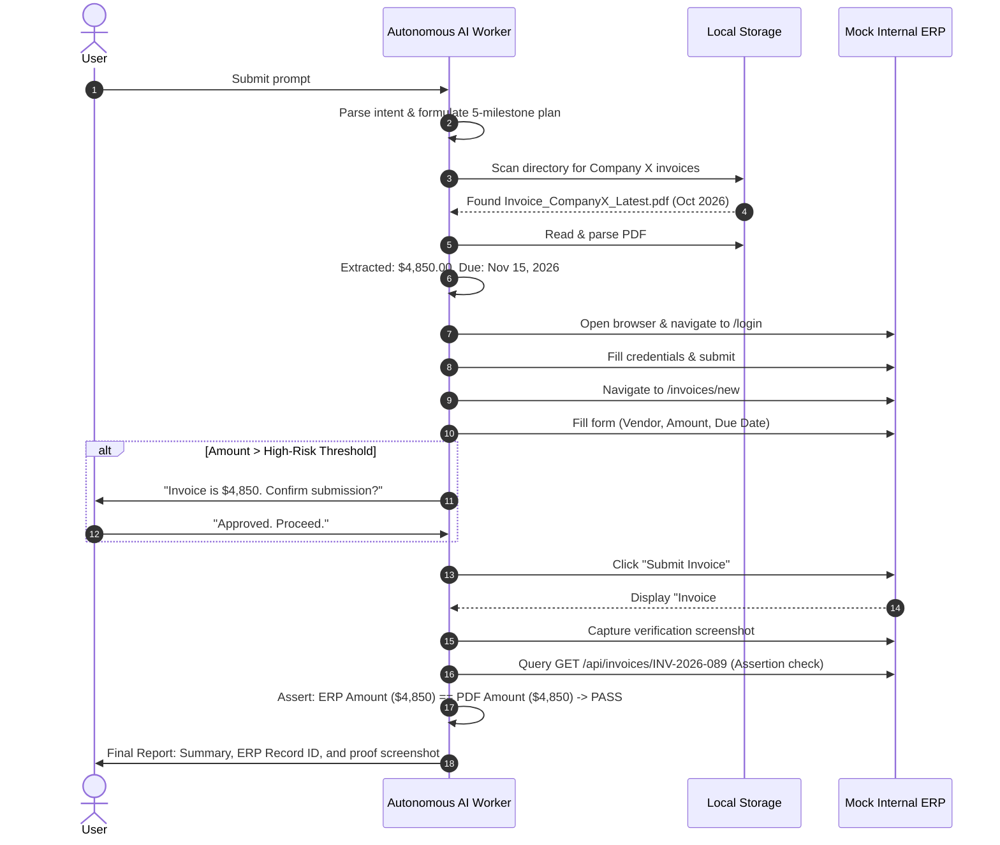

# Blueprint & Implementation Plan: Autonomous AI Task Worker

> **Project Goal**: Build a production-grade prototype of an autonomous AI worker capable of receiving high-level natural language instructions, decomposing goals into multi-step actions, executing them across simulated enterprise tools (browser, documents, APIs, ERP systems), handling errors gracefully with self-correction, requesting human approval when required, and presenting verifiable evidence of completion.

---

## 1. System Architecture & Conceptual Flow



---

## 2. Core Capabilities Matrix

| Requirement | Implementation Mechanism | Prototype Component |
| :--- | :--- | :--- |
| **Goal Understanding** | Intent classifier + structured JSON output schema defining target outcome, constraints, and success criteria. | `GoalParser` / `TaskSpec` |
| **Action Decomposition** | Hierarchical planning (High-level milestone plan + dynamic low-level step execution). | `TaskPlanner` |
| **Tool Execution** | Modular tool interfaces: Playwright (Browser), PyMuPDF/Vision (Docs), REST/DB (Enterprise ERP). | `ToolRegistry` & `ToolAdapters` |
| **Observation & State** | Structured feedback parser converting DOM snapshots, API JSON, and terminal results into scratchpad context. | `ObservationEngine` |
| **Working Memory** | Dynamic key-value context store + rolling execution trajectory with token pruning. | `AgentState` / `MemoryStore` |
| **Failure Detection** | Explicit status codes, assertion checks, DOM timeouts, and semantic validator. | `ExecutionGuard` |
| **Self-Healing / Retries** | Fallback heuristics (alternate DOM selectors, visual grounding, alternative API endpoints). | `RecoveryEngine` |
| **Human-in-the-Loop** | Confidence thresholds, high-impact action flags (funds transfer, deletions, sending emails). | `ApprovalGate` |
| **Outcome Verification** | Independent post-action assertions (e.g., querying ERP database/API to verify created record matches source). | `OutcomeVerifier` |
| **Evidence & Summary** | Automated audit log compilation with execution diffs, timestamps, and captured screenshots. | `EvidencePackager` |

---

## 3. Technology Stack Recommendation

- **Language & Runtime**: Python 3.11+
- **Agent Orchestration**: **LangGraph** (preferred for deterministic state machines, human-in-the-loop interrupts, and checkpointing) or lightweight custom **Pydantic + Async State Machine**.
- **LLM Engine**:
  - Primary Reasoning / Planning: `Gemini 1.5 Pro` / `GPT-4o` / `Claude 3.5 Sonnet`
  - Fast Perception / Extraction: `Gemini 1.5 Flash` / `GPT-4o-mini`
- **Browser Automation**: `Playwright` (Async Python) with Accessibility Tree parsing and screenshot-based visual grounding.
- **Document & Invoice Extraction**: `PyMuPDF` (Fitz) + Vision LLM extraction (handling both scanned and native PDF invoices).
- **Simulated Enterprise Portal**: **FastAPI** + **SQLite** + **Jinja2/Tailwind** (a standalone, locally running mini-ERP with Auth, Invoice Ledger, and Customer Directory).
- **User Interface & Dashboard**: **Streamlit** or **FastAPI + React/Vite** featuring:
  - Real-time agent thought streaming (ReAct loop logs)
  - Live browser viewport preview
  - Human approval interactive prompt modal
  - Final Evidence Report & verification badge
- **Observability & Logging**: Structured logging (`structlog` or `Loguru`) with JSON trace outputs.

---

## 4. Target Directory Structure

```text
CentrAlign_AI_Project/
├── .env.example                     # API keys and environment configuration
├── pyproject.toml / requirements.txt# Dependencies
├── README.md                        # Setup and demonstration instructions
├── mock_erp/                        # Standalone Mock Enterprise Application
│   ├── app.py                       # FastAPI server running the internal company portal
│   ├── database.py                  # SQLite schema (Invoices, Customers, Audit Log)
│   ├── templates/                   # UI for the company portal (Login, Invoicing dashboard)
│   └── static/                      # Static assets
├── data/
│   ├── sample_invoices/             # Sample PDF/PNG invoices (clean, edge case, malformed)
│   └── storage/                     # Agent runtime workspace, downloads, screenshots
├── worker/
│   ├── __init__.py
│   ├── config.py                    # Global settings and LLM parameters
│   ├── state.py                     # State definitions, TypedDict, schemas
│   ├── agent.py                     # Core agent loop (LangGraph graph or StateMachine)
│   ├── planner.py                   # Intent decomposition and milestone generator
│   ├── memory.py                    # Short-term scratchpad & key-value working memory
│   ├── verifier.py                  # Outcome verification and assertion checks
│   ├── approval.py                  # Human-in-the-loop pause/resume handler
│   ├── tools/
│   │   ├── __init__.py
│   │   ├── base.py                  # Base tool definition with validation schemas
│   │   ├── browser_tool.py          # Playwright browser controller with visual/DOM parser
│   │   ├── document_tool.py         # PDF & document extraction tool
│   │   ├── erp_api_tool.py          # Direct API tool for internal systems
│   │   └── file_tool.py             # File system search, read, write operations
│   └── reporting/
│       ├── evidence.py              # Compiles audit logs, screenshots, and diffs
│       └── templates/report.html    # HTML/Markdown summary template
├── ui/                              # Interactive monitoring dashboard
│   ├── dashboard.py                 # Streamlit or Web dashboard for driving tasks
│   └── components/                  # Live log viewers, approval buttons, screenshot viewer
└── tests/
    ├── test_planner.py              # Test goal decomposition
    ├── test_extraction.py           # Test invoice extraction accuracy
    ├── test_browser.py              # Test Playwright navigation against mock ERP
    └── test_end_to_end.py           # Full autonomous workflow test
```

---

## 5. Phased Implementation Roadmap

### Phase 1: Environment Setup & Simulated Enterprise Sandbox
> **Objective**: Create the complete local testbed so the agent has a realistic, repeatable target environment without external dependencies or risks.

1. **Initialize Project Environment**:
   - Set up virtual environment (`venv` or `poetry`), install core libraries (`playwright`, `fastapi`, `uvicorn`, `langgraph`, `google-genai` / `litellm`, `pymupdf`, `pydantic`).
   - Run `playwright install chromium`.
2. **Build the Mock ERP Portal (`mock_erp`)**:
   - Create a realistic internal accounting portal with:
     - Authentication (`/login` - username: `admin`, password: `company_secure_pass`)
     - Dashboard (`/dashboard`) showing invoices table with columns: `Invoice ID`, `Vendor Name`, `Amount`, `Due Date`, `Status`, `Created At`.
     - Creation Form (`/invoices/new`) with input validation, CSRF token simulation, and feedback alerts.
     - REST API (`/api/invoices`) for verification queries and direct API interaction.
3. **Generate Realistic Test Artifacts (`data/sample_invoices`)**:
   - Generate sample PDFs:
     - `Invoice_CompanyX_Latest.pdf`: Clean standard format ($4,850.00, Due: 2026-11-15).
     - `Invoice_CompanyX_Draft.pdf`: Older invoice to test "latest" logic ($2,100.00, Due: 2026-08-01).
     - `Invoice_CompanyY_Complex.pdf`: Multi-page or tabular invoice.

---

### Phase 2: Tooling & Environment Adapters
> **Objective**: Build rock-solid, deterministic tool primitives with standard inputs and structured outputs.

1. **Document & Invoice Extraction Tool (`worker/tools/document_tool.py`)**:
   - Extract raw text and metadata using PyMuPDF.
   - Combine with structured LLM parsing (Pydantic schema: `vendor_name`, `invoice_number`, `total_amount`, `currency`, `due_date`, `line_items`).
   - Add fallbacks for image/scan PDFs via Vision LLM.
2. **Browser Automation Tool (`worker/tools/browser_tool.py`)**:
   - Encapsulate Playwright with high-level agent actions:
     - `navigate(url)`
     - `click(selector_or_text)`
     - `fill(selector, text)`
     - `extract_page_content()` (simplified DOM tree with interactive element IDs / Set-of-Marks)
     - `capture_screenshot(label)`
     - `wait_for_condition(selector, state)`
   - Implement selector recovery: if CSS selector fails, fall back to accessible text, placeholder, or visual bounding box.
3. **File Management Tool (`worker/tools/file_tool.py`)**:
   - Directory search, finding the "latest" file by timestamp or semantic file name.
4. **Internal ERP API Tool (`worker/tools/erp_api_tool.py`)**:
   - Alternative programmatic tool for interacting with the internal portal when GUI is slow or unavailable.

---

### Phase 3: Agent Core & ReAct Execution State Machine
> **Objective**: Implement the cognitive cycle (Perceive -> Reason -> Act -> Reflect) with explicit memory and planning.

1. **State Definition (`worker/state.py`)**:
   - Design the global state schema:
     ```python
     class TaskState(TypedDict):
         user_goal: str
         milestones: list[str]
         current_milestone_index: int
         working_memory: dict[str, Any]      # Extracted data: {vendor, amount, due_date}
         execution_history: list[ActionStep]  # [{action, tool, input, output, screenshot}]
         errors_encountered: list[str]
         retry_count: int
         pending_approval: Optional[ApprovalRequest]
         verification_result: Optional[VerificationOutcome]
         is_complete: bool
         summary: str
     ```
2. **Goal Decomposer & Planner (`worker/planner.py`)**:
   - Prompt that translates user instruction into milestone checkpoints.
   - Example for the invoice prompt:
     1. Locate and identify latest invoice file for Company X.
     2. Extract total amount, currency, and due date.
     3. Open browser and log into internal ERP.
     4. Navigate to invoice entry and submit the extracted details.
     5. Confirm submission and capture proof.
3. **Execution & Reasoning Loop (`worker/agent.py`)**:
   - At each cycle, the LLM receives:
     - Target Goal & Active Milestone
     - Available Tools & Schema
     - Working Memory (stored facts)
     - Last Observation & Result
   - Decides: `tool_name`, `arguments`, and `internal_monologue` (reasoning).
4. **Self-Healing & Error Handling (`worker/recovery.py`)**:
   - Implement automatic recovery protocols:
     - On element not found: retry with relaxed matching or scroll into view.
     - On invalid date format: reformat extracted date to match portal's required pattern (`YYYY-MM-DD` vs `MM/DD/YYYY`).
     - On login failure: inspect error banner and retry or escalate.
     - Max retries per step (e.g., 3) before flagging for human intervention.

---

### Phase 4: Human-in-the-Loop (HITL) & Safety Guardrails
> **Objective**: Ensure the agent recognizes high-risk or ambiguous situations and pauses execution for human authorization.

1. **Policy Gatekeeper (`worker/approval.py`)**:
   - Define triggers for Human Approval:
     - **Ambiguity**: Multiple files matching "latest invoice" with identical dates.
     - **Financial Threshold**: Invoice amounts exceeding a safety limit (e.g., > $5,000).
     - **Destructive Action**: Deleting or overwriting existing records.
     - **Authentication Challenge**: Encountering unknown credentials or MFA prompt.
2. **Pause & Resume Mechanism**:
   - Utilize LangGraph interrupts or an async event queue.
   - When an approval trigger fires:
     - Save current execution snapshot.
     - Emit `ApprovalRequest(reason, proposed_action, context)`.
     - Wait for user `approve`, `reject`, or `clarify` input.
     - Resume execution with the human's guidance infused into working memory.

---

### Phase 5: Verification Engine & Evidence Packager
> **Objective**: Don't just trust that the action completed—independently prove it and generate audit artifacts.

1. **Outcome Verifier (`worker/verifier.py`)**:
   - Performs independent, post-execution assertion checks:
     - **UI Assertion**: Does the page display a "Successfully Created" confirmation toast?
     - **Data Consistency Assertion**: Query the ERP backend/API for the newly created invoice.
     - **Value Match Assertion**: Verify `db_record.amount == working_memory.amount` and `db_record.due_date == working_memory.due_date`.
2. **Evidence Packager (`worker/reporting/evidence.py`)**:
   - Collects all evidence into an auditable dossier:
     - **Visual Evidence**: Before and after screenshots (e.g., filled form + confirmation screen).
     - **Data Evidence**: JSON diff showing data extracted vs. data stored in the target system.
     - **Audit Trail**: Step-by-step chronology with timestamps, tool calls, and latency.
     - **Executive Summary**: 2-3 sentence human-readable outcome statement.

---

### Phase 6: User Interface & Interactive Demo Dashboard
> **Objective**: Build a compelling, intuitive UI to run the worker and watch it operate live.

1. **Dashboard Capabilities (`ui/dashboard.py`)**:
   - **Task Input Bar**: Prompt input box with quick preset scenarios (e.g., "Enter Company X Invoice", "Handle Ambiguous Vendor", "Exceed Budget Guardrail").
   - **Live Progress Stepper**: Visual milestone tracker (Planning -> Extracting -> Browsing -> Submitting -> Verifying).
   - **Agent Thought Stream**: Live expandable log showing LLM reasoning, tool calls, and observations.
   - **Live Viewport / Screenshots**: Live display of the browser capturing each action in the mock ERP.
   - **Human Approval Modal**: Interactive prompt allowing user to Approve, Decline, or Provide Clarifying Instructions.
   - **Final Completion Card**: Downloadable audit report with embedded evidence screenshots.

---

## 6. End-to-End Walkthrough Scenario

To demonstrate all 10 requirements in a single cohesive demo:

```text
User: "Find the latest invoice from Company X, extract the amount and due date, enter it into our internal system, and tell me once it is done."
```



---

## 7. Step-by-Step Implementation Checklist

- [ ] **Step 1: Project Scaffolding**
  - Create directory structure and configure Python environment.
  - Set up `.env` for model provider keys.
- [ ] **Step 2: Mock ERP System**
  - Implement FastAPI backend with SQLite storage and HTML frontend.
  - Verify manual login and invoice submission flow at `http://localhost:8000`.
- [ ] **Step 3: Test Document Generation**
  - Create sample PDFs containing varying invoice formats.
- [ ] **Step 4: Tool Implementations**
  - Build and unit test `document_tool.py` (PDF extraction).
  - Build and unit test `browser_tool.py` with Playwright.
- [ ] **Step 5: Agent ReAct Engine & State Machine**
  - Implement `AgentState`, planner, and tool execution loop.
  - Integrate working memory storage across steps.
- [ ] **Step 6: Self-Correction & Verification**
  - Add selector fallback, retry logic, and independent verification assertions.
- [ ] **Step 7: Human-in-the-Loop Implementation**
  - Add approval criteria for high-stakes tasks with interactive pausing.
- [ ] **Step 8: Interactive UI & Live Monitor**
  - Build Streamlit/Web dashboard displaying live browser actions, execution trace, and evidence cards.
- [ ] **Step 9: Demo & Validation Testing**
  - Execute end-to-end scenario: extract invoice -> input to ERP -> verify -> present report.
