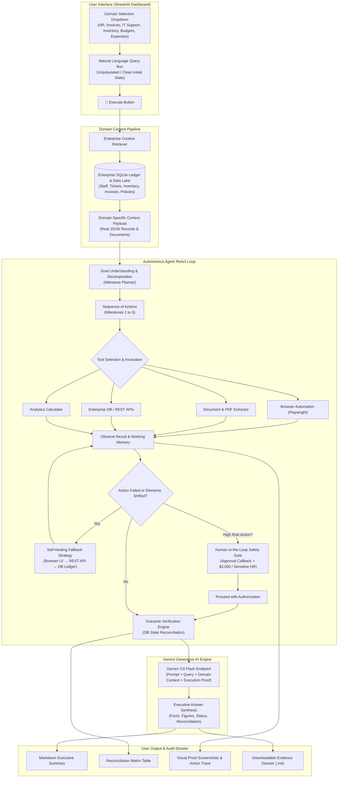

# CentrAlign Autonomous AI Task Worker — Project Architecture & Implementation Plan

> **Project Goal**: Enable a user to select an enterprise domain from a dropdown, write an unpopulated natural language query, click **Execute**, and autonomously process the request using real domain data and tools via **Google Gemini 3.8 Flash**, returning grounded answers, verified database updates, and auditable proof.

---

## 1. System Architecture Overview



---

## 2. Requirement Mapping to Autonomous Agent Capabilities

The 11 cognitive agent capabilities requested map directly to the CentrAlign architecture:

| # | Requested Agent Capability | Implementation Component | Technical Mechanism |
|---|---|---|---|
| **1** | **Understanding user's end goal** | `worker/planner.py` & `worker/agent.py` | Translates unstructured high-level intent into multi-step milestones without requiring micro-step instructions. |
| **2** | **Breaking request into action sequence** | `worker/planner.py` | Semantic intent parser & milestone generator producing 4–5 sequential milestones. |
| **3** | **Using available tools** | `worker/tools/` | `browser_tool` (Playwright), `document_tool` (PDF/TXT), `enterprise_db_tool` (SQLite CRUD), `erp_api_tool` (REST), `analytics_tool`. |
| **4** | **Observing result of each action** | `AutonomousWorker._log_step` in `worker/agent.py` | Records `ToolResult`, stdout, status code, and takes visual browser screenshots. |
| **5** | **Deciding next action based on outcome** | ReAct orchestrator loop in `worker/agent.py` | Dynamic state transitions based on milestone execution outcomes and perceptual feedback. |
| **6** | **Remembering relevant information** | `AgentState.working_memory` in `worker/state.py` | Persistent scratchpad carrying forward employee IDs, invoice numbers, dollar amounts, and balances. |
| **7** | **Detecting action failure** | `worker/tools/base.py` & `worker/agent.py` | Monitors exit codes, element timeouts, HTTP errors, and sets failure flags. |
| **8** | **Alternative retry & self-healing** | 3-tier fallback in `worker/agent.py` | Tier 1 (Browser UI) → Tier 2 (ERP REST API) → Tier 3 (Database Ledger Direct) with retry budgets. |
| **9** | **Outcome verification** | `worker/verifier.py` | Independent SQL query asserting target database state matches expected source values. |
| **10** | **Clarification & approval (HITL)** | `worker/approval.py` | Safety threshold checks ($3,000 financial limit, sensitive HR roles) with interactive UI callbacks. |
| **11** | **Concise summary & evidence** | `worker/reporting/evidence.py` & `worker/ai_engine.py` | Formatted executive response, data reconciliation table, visual screenshot gallery, and downloadable Markdown dossier. |

---

## 3. Step-by-Step Implementation Plan

### Phase 1: User Interface Enhancement (`ui/dashboard.py`)
1. **Domain Selection Dropdown**:
   - Provide a clean selectbox with enterprise domain options:
     - `👥 HR & Employee Management` (`hr_leave`)
     - `🧾 Finance & Invoices` (`invoice`)
     - `🎫 IT Support & Incident Helpdesk` (`ticket`)
     - `📦 Inventory & Supply Chain` (`inventory`)
     - `💰 Expense Auditing & Compliance` (`expense`)
     - `📊 Department Budgets & Analytics` (`budget`)
     - `📜 Corporate Policies & Governance` (`policy`)
     - `🌐 Cross-Department / General Overview` (`general`)
2. **Unpopulated Query Input**:
   - Clean `st.text_area(value="")` that starts blank with clear placeholder guidance.
3. **Execution Button**:
   - Single prominent `🚀 Execute Query` button that initiates execution.
4. **Domain Context Preview**:
   - Expander showing real records loaded from the database for the active domain.

### Phase 2: Domain Context Retriever Routing (`worker/context_retriever.py`)
1. Accept explicit `domain_override` from the user's dropdown choice.
2. Query corresponding tables in `mock_erp/database.py` and documentation in `data/company_docs/`.
3. Construct authentic JSON context containing live employees, open tickets, invoices, inventory items, and budget numbers.

### Phase 3: Autonomous Agent Multi-Tool Pipeline (`worker/agent.py`)
1. Pass selected `domain` directly to `AutonomousWorker.__init__(user_prompt, domain=...)`.
2. Dispatch domain-specific pipelines:
   - **HR Pipeline**: Lookup employee → Check PTO balance → Validate approval policy → Update HR ledger → Verify.
   - **Invoice Pipeline**: Locate PDF → Extract data → Check safety threshold ($3,000) → Register invoice → Verify.
   - **IT Ticket Pipeline**: Fetch tickets → Identify critical severity → Reassign to engineer → Mark in-progress → Verify.
   - **Inventory Pipeline**: Audit catalog → Find items below threshold → Calculate restock → Issue PO → Verify.
   - **Budget Pipeline**: Retrieve budget → Compute actual spend vs target → Calculate variance → Verify.
   - **General Query Pipeline**: Search policies and ledgers → Formulate verified answer.

### Phase 4: Gemini 3.8 Flash Integration (`worker/ai_engine.py`, `.env`)
1. Update `.env` to configure `DEFAULT_MODEL=gemini/gemini-3.8-flash` (with `gemini-3.1-flash-lite` fallback).
2. Configure HTTP client with a 45-second timeout and retry logic for high-demand scenarios.
3. Pass user query + authentic enterprise domain context directly into the Gemini prompt.
4. Fall back seamlessly to local intelligence engine if network is disconnected.

### Phase 5: Verification & Audit Dossier
1. Maintain programmatic verification (`worker/verifier.py`).
2. Display data reconciliation matrix in the Streamlit UI.
3. Provide one-click downloadable audit evidence dossier (`.md`).

---

## 4. Verification & Testing

1. **AI Pipeline Test**:
   ```powershell
   python tests/test_ai_pipeline.py
   ```
2. **Multi-Domain Test Suite**:
   ```powershell
   python tests/test_all_domains.py
   ```
3. **Streamlit UI Application**:
   ```powershell
   streamlit run ui/dashboard.py
   ```
